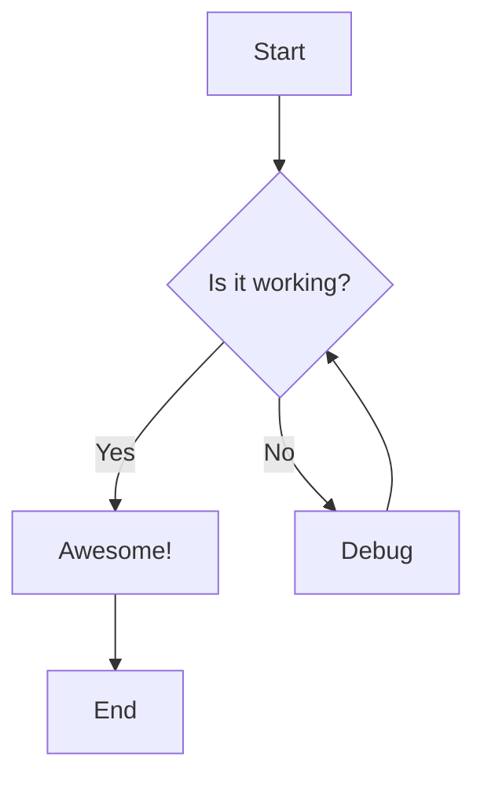
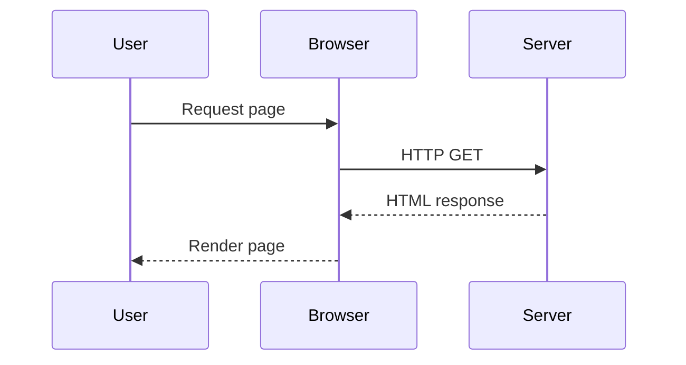
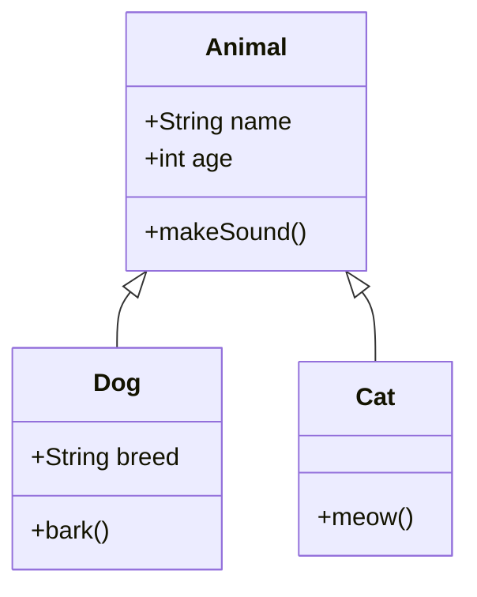
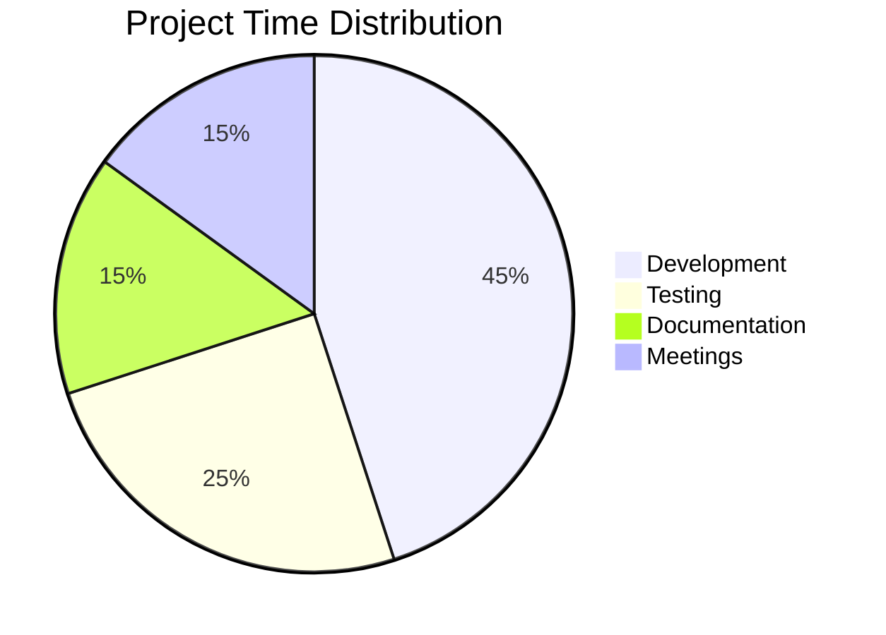

# Markdown with Mermaid Diagrams

This document demonstrates **Mermaid diagrams** embedded in markdown!

## Flowchart



## Sequence Diagram



## Class Diagram



## Regular Markdown Content

You can mix **regular markdown** with Mermaid diagrams seamlessly!

- Lists work fine
- Code blocks too:

```javascript
console.log('Hello from JavaScript!');
```

## Pie Chart



---

**Pretty cool, right?** 🎨
