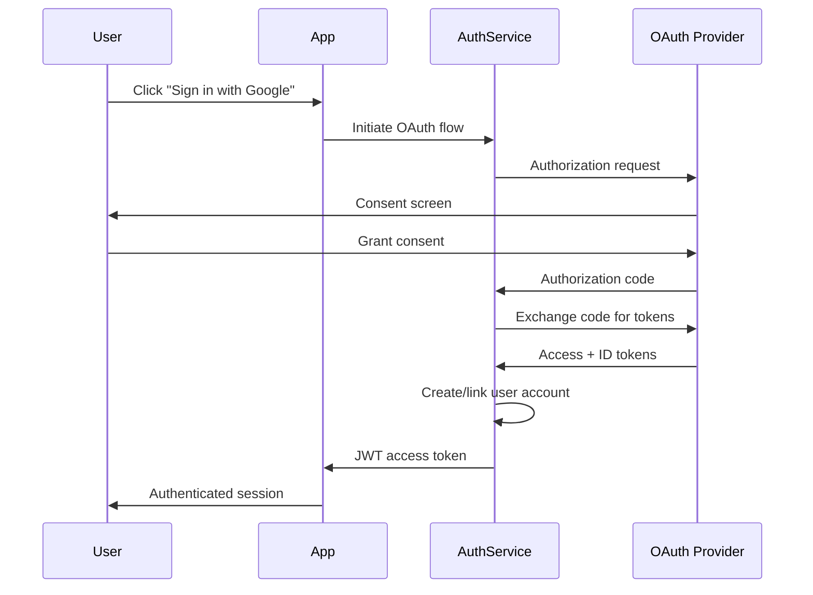

# Authentication System Redesign

This plan outlines the migration from session-based authentication to a JWT-based system with OAuth2 support. The goal is to improve security, enable stateless API access, and support third-party integrations.

## Phase 1: Foundation & Token Service

### Objectives

- Set up JWT token generation and validation
- Create refresh token rotation mechanism
- Implement secure token storage strategy

### Technical Approach

We'll use RS256 asymmetric signing for JWT tokens, allowing services to verify tokens without access to the private signing key. Key rotation will follow a 90-day cycle with overlap periods.

**Token Structure:**

| Field   | Type     | Description          |
| ------- | -------- | -------------------- |
| `sub`   | string   | User ID              |
| `iss`   | string   | Issuer identifier    |
| `exp`   | number   | Expiration timestamp |
| `scope` | string[] | Permission scopes    |
| `jti`   | string   | Unique token ID      |

### Implementation Tasks

- [x] Design JWT payload schema
- [x] Set up key generation and rotation
- [ ] Implement token service with sign/verify
- [ ] Add refresh token rotation logic
- [ ] Write unit tests for token lifecycle

### Code Changes

The core token service handles generation and validation:

```diff
 // auth/token-service.ts
-import { createSession } from './sessions';
+import { SignJWT, jwtVerify } from 'jose';
+import { getSigningKey, getPublicKey } from './key-manager';

-export function authenticate(user) {
-  return createSession(user.id);
+export async function authenticate(user) {
+  const key = await getSigningKey();
+  return new SignJWT({ sub: user.id, scope: user.permissions })
+    .setProtectedHeader({ alg: 'RS256', kid: key.id })
+    .setIssuedAt()
+    .setExpirationTime('15m')
+    .sign(key.privateKey);
 }
```

## Phase 2: OAuth2 Provider Integration

### Objectives

- Support Google, GitHub, and Microsoft OAuth2 flows
- Implement account linking for existing users
- Add PKCE support for public clients

### Architecture



### Implementation Tasks

- [ ] Create OAuth2 client abstraction layer
- [ ] Implement Google OAuth2 flow
- [ ] Implement GitHub OAuth2 flow
- [ ] Add account linking logic
- [ ] Handle edge cases (email conflicts, unverified emails)

### Configuration

Each provider requires specific configuration:

```javascript
const providers = {
  google: {
    clientId: process.env.GOOGLE_CLIENT_ID,
    authUrl: 'https://accounts.google.com/o/oauth2/v2/auth',
    tokenUrl: 'https://oauth2.googleapis.com/token',
    scopes: ['openid', 'profile', 'email'],
  },
  github: {
    clientId: process.env.GITHUB_CLIENT_ID,
    authUrl: 'https://github.com/login/oauth/authorize',
    tokenUrl: 'https://github.com/login/oauth/access_token',
    scopes: ['user:email'],
  },
};
```

## Phase 3: Migration & Rollout

### Strategy

The migration follows a phased rollout to minimize risk:

1. **Dual-mode period** (2 weeks) - Both session and JWT auth accepted
2. **Soft migration** (2 weeks) - New logins use JWT, existing sessions honored
3. **Hard cutover** - All sessions invalidated, JWT required

### Migration Tasks

- [ ] Add JWT middleware alongside session middleware
- [ ] Create session-to-JWT migration endpoint
- [ ] Implement feature flags for gradual rollout
- [ ] Set up monitoring dashboards
- [ ] Write rollback procedures

### Risk Assessment

| Risk                   | Likelihood | Impact   | Mitigation                            |
| ---------------------- | ---------- | -------- | ------------------------------------- |
| Token theft via XSS    | Medium     | High     | HttpOnly cookies, CSP headers         |
| Key rotation failures  | Low        | Critical | Automated monitoring, manual override |
| OAuth provider outages | Medium     | Medium   | Graceful degradation, cached tokens   |
| Migration data loss    | Low        | High     | Dry-run migrations, backup strategy   |

### Monitoring

> **Important:** All authentication events must be logged with full context for security auditing. Ensure PII is properly redacted in logs.

Key metrics to track during rollout:

- Authentication success/failure rates by method
- Token refresh patterns and failures
- OAuth flow completion rates
- Session migration progress percentage

## Phase 4: Security Hardening

### Additional Security Measures

- Rate limiting on auth endpoints (100 req/min per IP)
- Brute force detection with exponential backoff
- Token revocation list with Redis-backed cache
- Automated security scanning in CI/CD pipeline

#### Rate Limiting Configuration

```yaml
rate_limits:
  login:
    window: 60s
    max_requests: 10
    block_duration: 300s
  token_refresh:
    window: 60s
    max_requests: 30
  oauth_callback:
    window: 60s
    max_requests: 20
```

#### Audit Trail

Every authentication event generates an audit record:

- Login attempts (success/failure)
- Token generation and refresh
- OAuth flow initiation and completion
- Permission scope changes
- Account linking events
