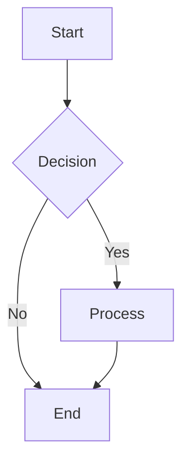
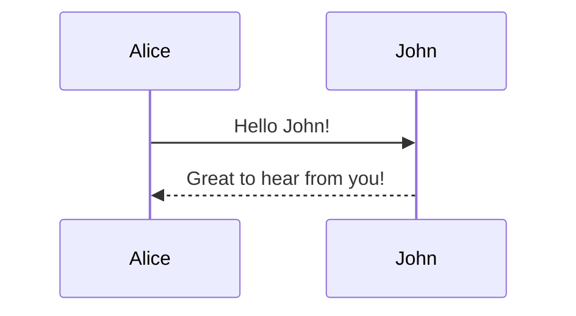
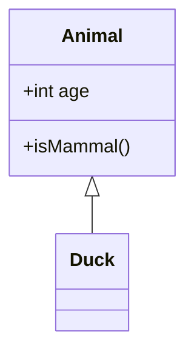
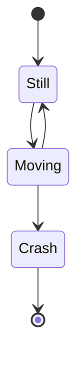

# Preview Mermaid Skill

Interactive Mermaid diagram viewer that renders flowcharts, sequence diagrams, class diagrams, ER diagrams, state diagrams, Gantt charts, pie charts, and more.

## Usage

```bash
# Preview a Mermaid diagram file
/preview diagram.mmd

# Pipe Mermaid content (preferred for temporary content)
cat flowchart.mermaid | /preview
echo "graph TD\n  A-->B" | /preview

# With custom background color
/preview sequence.mmd --background "#ffffff"
```

**Best Practice:** For temporary or generated content, prefer piping over creating temporary files. This avoids cluttering your filesystem and the content is automatically cleaned up.

## Options

The script works with sensible defaults but supports these flags for flexibility:

- `-o, --output PATH` - Custom output path
- `--no-browser` - Skip browser, output file path only

## Features

- **All diagram types** supported:
  - Flowcharts
  - Sequence diagrams
  - Class diagrams
  - State diagrams
  - ER diagrams (Entity-Relationship)
  - Gantt charts
  - Pie charts
  - Git graphs
  - User journey diagrams
  - Requirement diagrams
- **Interactive diagrams** with clickable nodes
- **Pan and zoom** for large diagrams
- **Export to SVG** functionality
- **Light/dark theme** support
- **Auto-layout** for optimal diagram rendering
- **Responsive design** adapts to screen size

## When to Use This Skill

Use this skill when the user wants to:

- Visualize flowcharts and process diagrams
- Create sequence diagrams for system interactions
- Document software architecture with class diagrams
- Design database schemas with ER diagrams
- Plan projects with Gantt charts
- Share visual documentation

## Examples

**Natural language requests:**

- "preview this flowchart"
- "show me the sequence diagram"
- "visualize the state machine"
- "render the ER diagram"
- "display the class diagram"

## Technical Details

### File Requirements

- File extensions: `.mmd`, `.mermaid`
- Maximum size: 10MB (configurable)
- Encoding: UTF-8

### Supported Diagram Types

#### Flowchart



#### Sequence Diagram



#### Class Diagram



#### State Diagram



### Features in Detail

#### Interactive Diagrams

- Click nodes to follow links
- Hover for tooltips (if defined)
- Pan by dragging
- Zoom with mouse wheel

#### Export

- One-click SVG export
- High-quality vector graphics
- Preserves all styling

#### Theme Support

- Light theme (default)
- Dark theme
- Custom themes via CSS

### Browser Compatibility

- Modern browsers (Chrome, Firefox, Safari, Edge)
- Requires JavaScript enabled
- CDN-dependent: Mermaid.js library

## Output

The skill generates a standalone HTML file at:

```
/tmp/preview-skills/preview-mermaid-{filename}.html
```

The file is self-contained and can be:

- Opened directly in any browser
- Shared with others (requires internet for CDN assets)
- Archived for later viewing

## Troubleshooting

### Diagram doesn't render

- Check Mermaid syntax for errors
- Verify diagram type is supported
- Check browser console for JavaScript errors
- Ensure proper indentation and structure

### Syntax errors

- Use Mermaid Live Editor to validate syntax
- Check for missing arrows, brackets, or quotes
- Verify proper node ID format (no spaces in IDs)

### Layout issues

- Try different diagram orientations (TD, LR, etc.)
- Adjust node labels for better fit
- Use subgraphs to organize complex diagrams

### Export not working

- Ensure browser supports SVG download
- Check popup blockers
- Try downloading from file menu

## Development

This skill is standalone and includes all dependencies:

- Shared libraries bundled in `lib/`
- Templates bundled in `templates/`
- External CDN dependencies:
  - mermaid.js (diagram rendering)

To modify the skill:

1. Edit `config.sh` for configuration
2. Edit `templates/scripts/mermaid-renderer.js` for behavior
3. Edit `templates/styles/diagram.css` for styling
4. Run `run.sh` to test changes

## Learn More

For Mermaid syntax and examples:

- https://mermaid.js.org/
- https://mermaid.live/ (Live editor)
